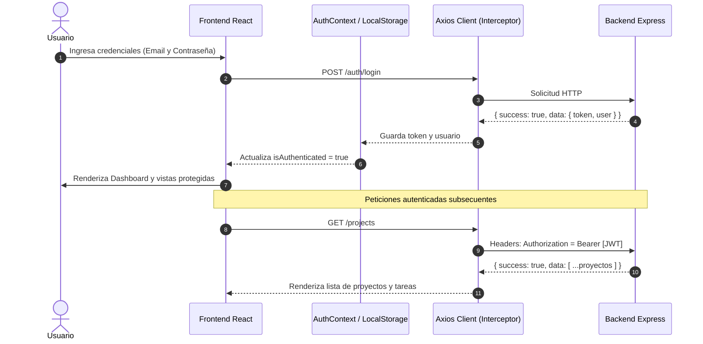

# 🚀 TaskFlow Frontend — Sistema de Gestión de Proyectos y Tareas

Aplicación Web de alto rendimiento desarrollada en **React**, construida como evaluación final del **Módulo 7**, orientada a la administración integral de proyectos y tareas consumiendo la API REST de Express + PostgreSQL (**TaskFlow API**).

---

## 📋 Tabla de Contenidos
1. [Descripción General](#-descripción-general)
2. [Características Principales](#-características-principales)
3. [Tecnologías y Conceptos de React Aplicados](#-tecnologías-y-conceptos-de-react-aplicados)
4. [Estructura del Proyecto](#-estructura-del-proyecto)
5. [Requisitos Previos](#-requisitos-previos)
6. [Instalación y Puesta en Marcha](#-instalación-y-puesta-en-marcha)
   - [Configuración del Backend (API)](#1-configuración-del-backend-api)
   - [Configuración del Frontend (React)](#2-configuración-del-frontend-react)
7. [Variables de Entorno](#-variables-de-entorno)
8. [Flujo de Autenticación y Consumo de API](#-flujo-de-autenticación-y-consumo-de-api)
9. [Guía de Uso de la Aplicación](#-guía-de-uso-de-la-aplicación)

---

## 🌟 Descripción General

**TaskFlow** es una plataforma moderna, intuitiva y reactiva diseñada para optimizar la productividad personal y de equipos de trabajo. Permite a los usuarios autenticarse de forma segura mediante **JWT**, organizar sus metas a través de **Proyectos**, y gestionar detalladamente sus **Tareas** mediante vistas en lista y tableros interactivos tipo **Kanban**.

---

## ✨ Características Principales

### 🔐 1. Autenticación y Seguridad
- **Registro de Usuarios**: Validación en tiempo real de nombre, correo y fortaleza/coincidencia de contraseña.
- **Inicio de Sesión**: Autenticación mediante credenciales con respuesta tokenizada.
- **Gestión de Sesión con JWT**: Almacenamiento seguro en `localStorage` con verificación automática de token (`/auth/me`) e interceptor Axios para adjuntar `Bearer <token>` y gestionar expiración (401).

### 📊 2. Dashboard y Panel de Control
- **Métricas Globales (KPIs)**: Indicadores de Proyectos Totales, Proyectos Activos, Tareas Totales, Tareas Pendientes y Tareas Completadas.
- **Barra de Progreso General**: Visualización porcentual de cumplimiento de todas las tareas.
- **Acceso Rápido a Proyectos Recientes y Tareas Urgentes**.
- **Indicador de Conectividad de API (Live Health Status)**: Badge en tiempo real que notifica el estado de conexión con el backend (`http://localhost:3000/api`).

### 📁 3. Gestión Integral de Proyectos (CRUD)
- **Creación**: Modal con validación de nombre, descripción y estado (`Activo`, `En Progreso`, `Completado`, `Archivado`).
- **Listado y Filtros**: Búsqueda por texto y filtrado por estado.
- **Edición**: Actualización inmediata reflejada en el estado global.
- **Eliminación**: Modal de confirmación destructiva y borrado seguro.
- **Detalle de Proyecto**: Vista dedicada con información del proyecto, progreso específico y gestión de sus tareas asociadas.

### ✅ 4. Gestión Completa de Tareas (CRUD & Estados)
- **Creación de Tareas**: Asociación a proyectos o tareas generales con validación de título y descripción.
- **Edición y Eliminación**: Modificación rápida y confirmación antes de borrar.
- **Cambio de Estado Instantáneo**: Checkbox animado para marcar como completada/pendiente mediante llamada optimizada a la API.
- **Vista Dual**:
  - **Vista Lista**: Pestañas para filtrar (Todas, Pendientes, Completadas) y barra de búsqueda.
  - **Vista Tablero (Kanban)**: Columnas separadas de *Por Hacer* y *Completadas* con conteo dinámico.
- **Filtro por Proyecto**: Selector para aislar tareas pertenecientes a un proyecto específico.

### 🎨 5. Experiencia de Usuario (UI/UX)
- **Design System Propio**: Variables CSS personalizadas, sombras refinadas, paleta moderna (Indigo / Slate / Emerald).
- **Sistema de Notificaciones (Toasts)**: Alertas flotantes contextuales (Éxito, Error, Advertencia, Información).
- **Estados de Carga y Vacíos**: Spinners y Empty States con llamadas a la acción cuando no hay datos.

---

## ⚛️ Tecnologías y Conceptos de React Aplicados

| Concepto de React / Herramienta | Implementación en el Proyecto |
| :--- | :--- |
| **Componentes Funcionales** | 100% de la arquitectura construida con componentes funcionales limpios y reutilizables. |
| **Props y Desestructuración** | Paso unidireccional de datos, handlers y estados a componentes hijos. |
| **`useState`** | Control granular de estados locales (inputs, visibilidad de modales, filtros, modo de vista). |
| **`useEffect`** | Carga asíncrona inicial, sincronización con API, verificación de sesión y listeners de teclado (Escape en modales). |
| **Context API** | - `AuthContext`: Manejo de usuario, token JWT, login, register y logout.<br>- `ProjectContext`: Estado global de proyectos, tareas y estadísticas.<br>- `ToastContext`: Disparo y cola de notificaciones animadas. |
| **Custom Hooks y Callbacks** | `useAuth`, `useProjects`, `useToast`, `useCallback` y `useMemo` para optimización de renderizados. |
| **Formularios Reactivos** | Validación campo por campo con feedback visual y prevención de doble submit. |
| **Consumo de API con Axios** | Interceptores de petición (JWT Bearer) y respuesta (manejo de 401 y errores de red). |
| **Renderizado Condicional** | Muestra de login/dashboard según autenticación, toggles de modales, vistas Lista vs Kanban y empty states. |

---

## 📂 Estructura del Proyecto

```text
MODULO7/
├── public/                     # Archivos estáticos y favicon
├── src/
│   ├── api/                    # Capa de consumo HTTP con Axios
│   │   ├── axiosClient.js      # Cliente configurado con interceptores JWT
│   │   ├── authApi.js          # Endpoints de autenticación (/auth)
│   │   ├── projectApi.js       # Endpoints de proyectos (/projects)
│   │   ├── taskApi.js          # Endpoints de tareas (/tasks)
│   │   └── healthApi.js        # Health check del backend (/health)
│   ├── components/             # Componentes modulares
│   │   ├── auth/               # LoginForm, RegisterForm, AuthLayout
│   │   ├── common/             # Button, Input, Textarea, Select, Modal, ConfirmModal, Badge, Spinner, Toast, ApiStatusBadge, Sidebar, Navbar
│   │   ├── dashboard/          # DashboardMetrics, RecentProjects, UrgentTasks
│   │   ├── projects/           # ProjectCard, ProjectList, ProjectFormModal, ProjectDetails
│   │   └── tasks/              # TaskItem, TaskList, TaskKanban, TaskFormModal
│   ├── context/                # Manejadores de estado global (Context API)
│   │   ├── AuthContext.jsx     # Contexto de autenticación y JWT
│   │   ├── ProjectContext.jsx  # Contexto de proyectos, tareas y KPIs
│   │   └── ToastContext.jsx    # Contexto del sistema de notificaciones
│   ├── pages/                  # Vistas principales de la aplicación
│   │   ├── DashboardPage.jsx   # Vista de Dashboard con KPIs y resúmenes
│   │   ├── ProjectsPage.jsx    # Gestión general y detalle de proyectos
│   │   └── TasksPage.jsx       # Gestión y tablero de tareas
│   ├── styles/
│   │   └── index.css           # Design System, variables CSS y animaciones
│   ├── App.jsx                 # Componente raíz con enrutamiento de vistas
│   └── main.jsx                # Entry point con composición de providers
├── .env                        # Variables de entorno para desarrollo
├── .env.example                # Plantilla de variables de entorno
├── index.html                  # HTML base con fuentes Google Fonts
├── package.json                # Dependencias y scripts de ejecución
└── vite.config.js              # Configuración del bundler Vite
```

---

## ⚙️ Requisitos Previos

- **Node.js**: Versión 18.0.0 o superior (verificar con `node -v`).
- **npm**: Versión 9.0.0 o superior (verificar con `npm -v`).
- **PostgreSQL**: Servidor de base de datos para el backend de Express.

---

## 🛠️ Instalación y Puesta en Marcha

### 1. Configuración del Backend (API)

El backend utilizado es el desarrollado en el Módulo 4 (`project-task-flow-api`):

1. Dirígete a la carpeta del backend:
   ```bash
   cd "f:\DIPLOMADOS\USIP\MODULO 4\proyecto"
   ```
2. Instala las dependencias:
   ```bash
   npm install
   ```
3. Configura las variables en su archivo `.env` (puerto `3000`, credenciales de PostgreSQL y `JWT_SECRET`).
4. Inicia el servidor backend:
   ```bash
   npm run dev
   ```
   *El servidor quedará disponible en `http://localhost:3000` con documentación Swagger en `http://localhost:3000/api-docs`.*

---

### 2. Configuración del Frontend (React)

1. Abre una nueva terminal y dirígete a la carpeta del Módulo 7:
   ```bash
   cd "f:\DIPLOMADOS\USIP\MODULO7"
   ```
2. Instala las dependencias:
   ```bash
   npm install
   ```
3. Verifica que el archivo `.env` contenga la URL correcta del backend:
   ```env
   VITE_API_URL=http://localhost:3000/api
   ```
4. Inicia el servidor de desarrollo:
   ```bash
   npm run dev
   ```
5. Abre en tu navegador la URL que indique la consola (normalmente `http://localhost:5173`).

---

## 🔑 Variables de Entorno

| Variable | Descripción | Valor por Defecto |
| :--- | :--- | :--- |
| `VITE_API_URL` | URL base de los endpoints REST del backend | `http://localhost:3000/api` |

---

## 🔄 Flujo de Autenticación y Consumo de API



---

## 📖 Guía de Uso de la Aplicación

1. **Crear una Cuenta**: En la pantalla inicial, haz clic en *"Regístrate aquí"*, completa tu nombre, correo y contraseña.
2. **Dashboard**: Al ingresar, podrás visualizar tus métricas de productividad, estado de la conexión con la API y accesos rápidos.
3. **Crear Proyectos**: Ve a la sección **Proyectos** y haz clic en *"Nuevo Proyecto"*. Puedes asignarle nombre, descripción y estado.
4. **Gestionar Tareas**:
   - Dentro del detalle de un proyecto, haz clic en *"Nueva Tarea"*.
   - Alterna entre la vista de **Lista** y la vista de **Tablero** (Kanban).
   - Haz clic en el círculo/check de cualquier tarea para cambiar su estado a completada.
5. **Filtros Globales**: En la sección **Mis Tareas**, usa el selector superior para filtrar tareas de un proyecto específico o buscar por texto en tiempo real.
6. **Cerrar Sesión**: Haz clic en el botón de salida en la esquina inferior del menú lateral para revocar la sesión activa.

---

Desarrollado con ❤️ aplicando las mejores prácticas de **React**, **Clean Code** y **Diseño UI/UX**.
